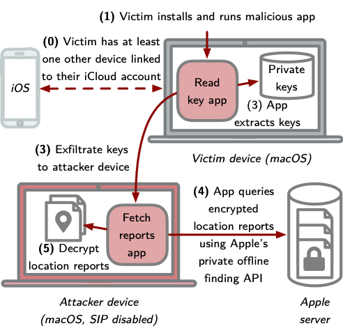

# PoPETs Artifact Review

We submit the research artifacts of our paper **Who Can _Find My_ Devices? Security and Privacy of Apple's Crowd-Sourced Bluetooth Location Tracking System** to the [PoPETs Artifact Review](https://petsymposium.org/artifacts.php) process.
Our submission includes (1) the experimental evaluation of the offline finding system in Section 7 of our paper and (2) the PoC implementation of the attack presented in Section 10.
The [_OpenHaystack_](README.md) framework in this repository goes beyond the contributions made in our PoPETs paper and, therefore, is not part of our submission. However, we invite the reviewers to test this code as well.

## Location Report Accuracy (Section 7)

We provide the raw data and evaluation scripts used for the experimental evaluation of the offline finding system in Section 7 of our paper.
The code should be self-explanatory and generates Figures 4, 5, 8, 9, 10, and 11 and Tables 5, 6, and 7 of our paper.

### Requirements

- Web browser to run the code via the online [Binder](https://mybinder.org) service  
  _Alternative:_ Python environment to run the code locally

### Instructions

We implement all code in a single Jupyter notebook provided in an external repository. Please refer to the included README file for detailed instructions: https://github.com/seemoo-lab/offline-finding-evaluation.

## Unauthorized Access of Location History (Section 10)

We provide a proof-of-concept (PoC) implementation of the attack presented in Section 10 of our paper.
The PoC consists of two parts: (1) the application that reads the private keys from the victim's device and (2) the application that downloads and decrypts the corresponding location reports.

### Requirements

Since our PoC targets a fixed vulnerability in macOS 10.15.7, the reviewer requires a device that is vulnerable to the attack. A second Apple device is required to trigger the generation and synchronization of keys. In summary, the reviewer needs

- a macOS device running macOS 10.15.6 or earlier (provided as a VM) and
- a second iOS (>=13.0) or macOS (>=10.15.0) device.

Both devices need to be logged into the same iCloud account, and both participate in Apple's _Find My network_ (see [Apple's official documentation](https://support.apple.com/en-us/HT210400)).

### Instructions

The PoC consists of two applications that are needed: _OFReadKeys_ and _OFFetchReports_. _OFReadKeys_ is the malicious application installed by a user. The user needs to install this application manually. _OFFetchReports_ must run on the attacker's Mac. We provide the schematic overview from our paper below.
For testing, both applications can also be installed on the same machine, which we describe in the following.

#### Preparation: disable SIP and AMFI

The attacker machine needs to have system integrity protection (SIP) and AMFI **disabled**. This allows _OFFetchReports_ to access Apple account tokens necessary to authenticate at iCloud to download location reports.

1. Boot macOS into recovery mode (hold ⌘+R during boot).
2. Open Terminal (from the _Utilities_ drop-down menu).
3. Execute `csrutil disable` in Terminal to disable SIP.
4. Execute `nvram boot-args="amfi_get_out_of_my_way=0x1"` to disable AMFI.
5. Reboot macOS normally.

#### Reading keys

6. Open the Xcode project in [CVE-2020-9986/OFReadKeys](CVE-2020-9986/OFReadKeys).
7. Run the _OFReadKeys_ target.
8. Export the advertisement keys using the single button to a file.

#### Fetching reports

9. Run the _Run OFFetchReports_ target.
10. Import the exported key file via drag and drop.
11. Watch _OFFetchReports_ downloading and decrypting the location reports.
