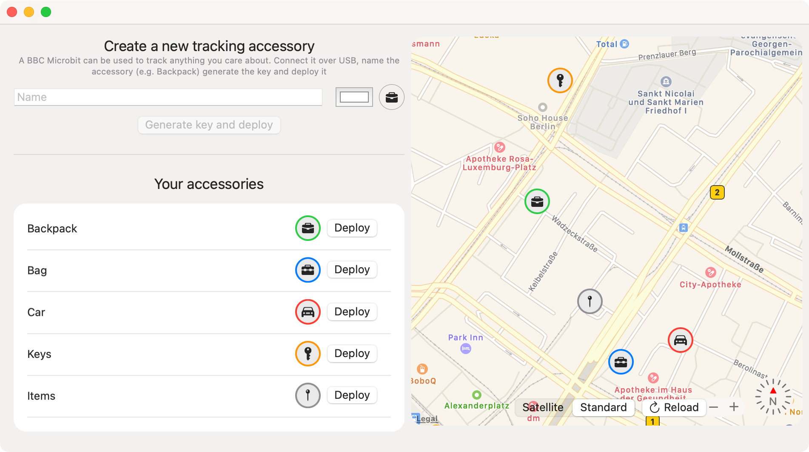
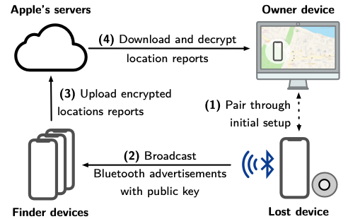
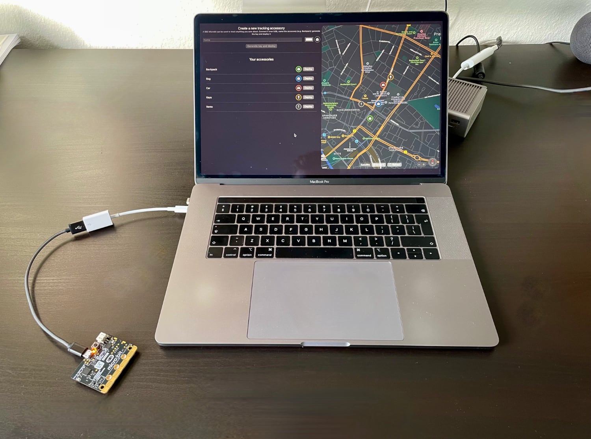

#  OpenHaystack

OpenHaystack is a framework for tracking personal Bluetooth devices via Apple's massive Find My network. Use it to create your own tracking _tags_ that you can append to physical objects (keyrings, backpacks, ...) or integrate it into other Bluetooth-capable devices such as notebooks.

## Table of contents

- [What is _OpenHaystack_?](#what-is-openhaystack)
  - [History](#history)
  - [Disclaimer](#disclaimer)
- [How to use _OpenHaystack_?](#how-to-use-openhaystack)
  - [System requirements](#system-requirements)
  - [Installation](#installation)
  - [Usage](#usage)
- [How does Apple's Find My network work?](#how-does-apples-find-my-network-work)
  - [Pairing](#pairing-1)
  - [Losing](#losing-2)
  - [Finding](#finding-3)
  - [Searching](#searching-4)
- [How to track other Bluetooth devices?](#how-to-track-other-bluetooth-devices)
- [Authors](#authors)
- [References](#references)
- [License](#license)

## What is _OpenHaystack_?

OpenHaystack is an application that allows you to create your own accessories that are tracked by Apple's [Find My network](#how-does-apples-find-my-network-work). All you need is a Mac and a [BBC micro:bit](https://microbit.org/) or any [other Bluetooth-capable device](#how-to-track-other-bluetooth-devices).
By using the app, you can track your accessories anywhere on earth without cellular coverage. Nearby iPhones will discover your accessories and upload their location to Apple's servers when they have a network connection.

### History

OpenHaystack is the result of reverse-engineering and security analysis work of Apple's _Find My network_ (or _offline finding_). We at the [Secure Mobile Networking Lab](https://seemoo.de) of TU Darmstadt started analyzing offline finding after its initial announcement in June 2019. We identified how Apple devices can be found by iPhones devices, even when they are offline through this work. The whole system is a clever combination of Bluetooth advertisements, public-key cryptography, and a central database of encrypted location reports. We disclosed a specification of the closed parts of offline finding and conducted a comprehensive security and privacy analysis.
We found two distinct vulnerabilities. The most severe one, which allowed a malicious application to access location data, has meanwhile been fixed by Apple ([CVE-2020-9986](https://support.apple.com/en-us/HT211849)).
For more information about the security analysis, please read [our paper](#references).
Since its release, we received quite a bit of [press and media coverage](https://owlink.org/press/).

### Disclaimer

OpenHaystack is experimental software. The code is untested and incomplete. For example, OpenHaystack accessories using our [firmware](Firmware) broadcast a fixed public key and, therefore, are trackable by other devices in proximity (this might change in a future release). OpenHaystack is not affiliated with or endorsed by Apple Inc.

## How to use _OpenHaystack_?

OpenHaystack consists of two components. First, we provide a [macOS application](OpenHaystack) that can display the last reported location of your personal Bluetooth devices. Second, the [firmware image](Firmware) enables Bluetooth devices to broadcast beacons that make them discoverable by iPhones.

### System requirements

OpenHaystack requires macOS 11 (Big Sur).

### Installation

The OpenHaystack application requires a custom plugin for Apple Mail. It is used to download location reports from Apple's servers via a private API (technical explanation: the plugin inherits Apple Mail's entitlements required to use this API).
Therefore, the installation procedure is slightly different and requires you to temporarily disable [Gatekeeper](https://support.apple.com/guide/security/gatekeeper-and-runtime-protection-sec5599b66df/1/web/1).
Our plugin does not access any other private data such as emails (see [source code](OpenHaystack/OpenHaystackMail)).

1. Download a precompiled binary release from our <a href="https://github.com/seemoo-lab/openhaystack/releases">GitHub page</a>.  
   _Alternative:_ build the application from source via Xcode.
2. Open OpenHaystack. This will ask you to install the Mail plugin in `~/Library/Mail/Bundle`.
3. Open a terminal and run `sudo spctl --master-disable`, which will disable Gatekeeper and allow our Apple Mail plugin to run.
4. Open Apple Mail. Go to _Preferences_ → _General_ → _Manage Plug-Ins..._ and activate the checkbox next to _OpenHaystackMail.mailbundle_.
   * If the _Manage Plug-Ins..._ button does not appear. Run this command in terminal `sudo defaults write "/Library/Preferences/com.apple.mail" EnableBundles 1`
5. Allow access and restart Mail.
6. Open a terminal and enter `sudo spctl --master-enable`, which will enable Gatekeeper again.

### Usage

**Adding a new accessory.**
To create a new accessory, you just need to enter a name for it and optionally select a suitable icon and a color. The app then generates a new key pair that is used to encrypt and decrypt the location reports. The private key is stored in your Mac's keychain.

**Deploy to device.**
Connect a [supported device](#how-to-track-other-bluetooth-devices) via USB to your Mac and hit the _Deploy_ button next to the accessory's name and choose the corresponding.
Instead of using OpenHaystack's integrated deployment, you may also copy the public key used for advertising (right click on accessory) and deploy it manually.

**Display devices' locations.**
It can take up to 30 minutes until you will see the first location report on the map on the right side. The map will always show all your items' most recent locations. You can click on every item to check when the last update was received.
By clicking the reload button, you can update the location reports.

## How does Apple's Find My network work?

We briefly explain Apple's offline finding system (aka [_Find My network_](https://developer.apple.com/find-my/)). Please refer to our [PETS paper and Apple's accessory specification](#references) for more details. We provide a schematic overview (from our paper) and explain how we integrate the different steps in OpenHaystack below.

### Pairing (1)

To use Apple's Find My network, we generate a public-private key pair on an elliptic curve (P-224). The private key remains on the Mac securely stored in the keychain, and the public key is deployed on the accessory, e.g., an attached micro:bit.

### Losing (2)

In short, the accessories broadcast the public key as Bluetooth Low Energy (BLE) advertisements (see [firmware](Firmware)).
Nearby iPhones will not be able to distinguish our accessories from a genuine Apple device or certified accessory.

### Finding (3)

When a nearby iPhone receives a BLE advertisement, the iPhone fetches its current location via GPS, encrypts it using public key from the advertisement, and uploads the encrypted report to Apple's server.
All iPhones on iOS 13 or newer do this by default. OpenHaystack is not involved in this step.

### Searching (4)

Apple does not know which encrypted locations belong to which Apple account or device. Therefore, every Apple user can download any location report as long as they know the corresponding public key. This is not a security issue: all reports are end-to-end encrypted and cannot be decrypted unless one knows the corresponding private key (stored in the keychain). We leverage this feature to download the reports from Apple that have been created for our OpenHaystack accessories. We use our private keys to decrypt the location reports and show the most recent one on the map.

Apple protects their database against arbitrary access by requiring an authenticated Apple user to download location reports.
We use our Apple Mail plugin, which runs with elevated privileges, to access the required authentication information. The OpenHaystack app communicates with the plugin while downloading reports. This is why you need to keep Mail open while using OpenHaystack.

## How to track other Bluetooth devices?

In principle, any Bluetooth device can be turned into an OpenHaystack accessory that is trackable via Apple's Find My network.
Currently, we provide a convenient deployment method of our OpenHaystack firmwares for a small number of embedded devices (see table below). We also support Linux devices via our generic HCI script.
Feel free to port OpenHaystack to other devices that support Bluetooth Low Energy based on the [source code of our firmware](Firmware) and the specification in [our paper](#references). Please share your results with us!

| Platform | Tested on | Deploy via app | Comment |
|----------|-----------|:--------------:|---------|
| [Nordic nRF51](Firmware/Microbit_v1) | BBC micro:bit v1 | ✓ | Only supports nRF51288 at this time (see issue #6). |
| [Espressif ESP32](Firmware/ESP32) | SP32-WROOM, ESP32-WROVER | ✓ | Deployment can take up to 3 minutes. Requires Python 3. Thanks **@fhessel**. |
| [Linux HCI](Firmware/Linux_HCI) | Raspberry Pi 4 w/ Raspbian | | Should support any Linux machine. |

## Authors

- **Alexander Heinrich** ([@Sn0wfreezeDev](https://github.com/Sn0wfreezeDev), [email](mailto:aheinrich@seemoo.tu-darmstadt.de))
- **Milan Stute** ([@schmittner](https://github.com/schmittner), [email](mailto:mstute@seemoo.tu-darmstadt.de), [web](https://seemoo.de/mstute))

## References

- Alexander Heinrich, Milan Stute, Tim Kornhuber, Matthias Hollick. **Who Can _Find My_ Devices? Security and Privacy of Apple's Crowd-Sourced Bluetooth Location Tracking System.** _Proceedings on Privacy Enhancing Technologies (PoPETs)_, 2021. [📄 Preprint](https://arxiv.org/abs/2103.02282).
- Tim Kornhuber. **Analysis of Apple's Crowd-Sourced Location Tracking System.** _Technical University of Darmstadt_, Master's thesis, 2020.
- Apple Inc. **Find My Network Accessory Specification – Developer Preview – Release R3.** 2020. [📄 Download](https://developer.apple.com/find-my/).

## License

OpenHaystack is licensed under the [**GNU Affero General Public License v3.0**](LICENSE).
