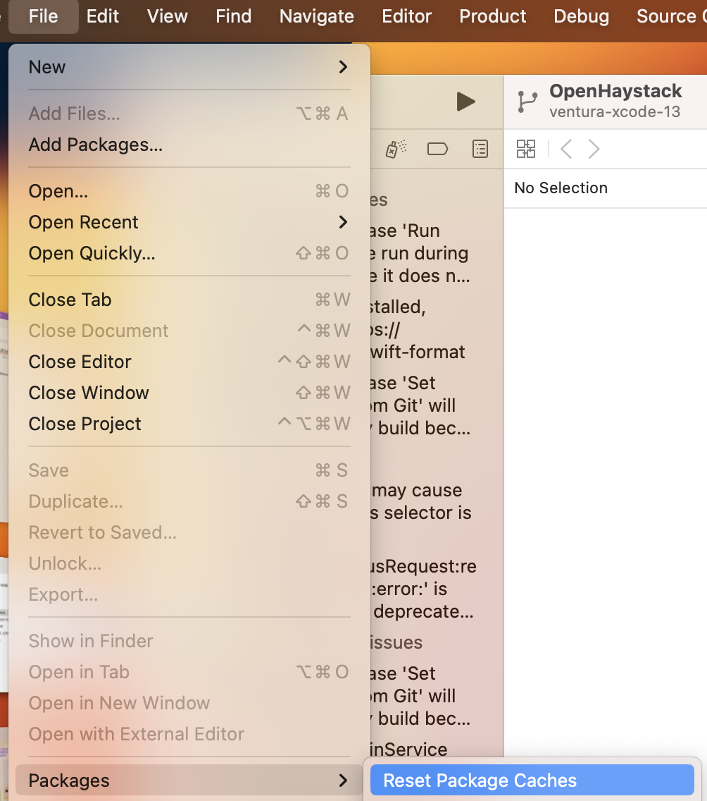
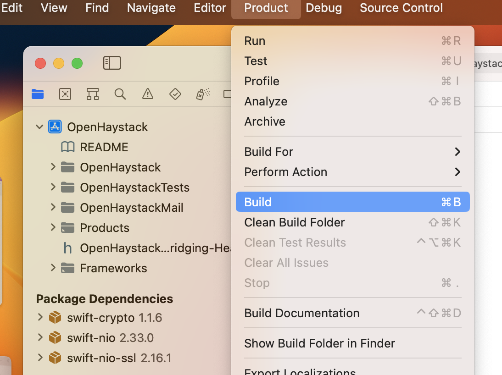
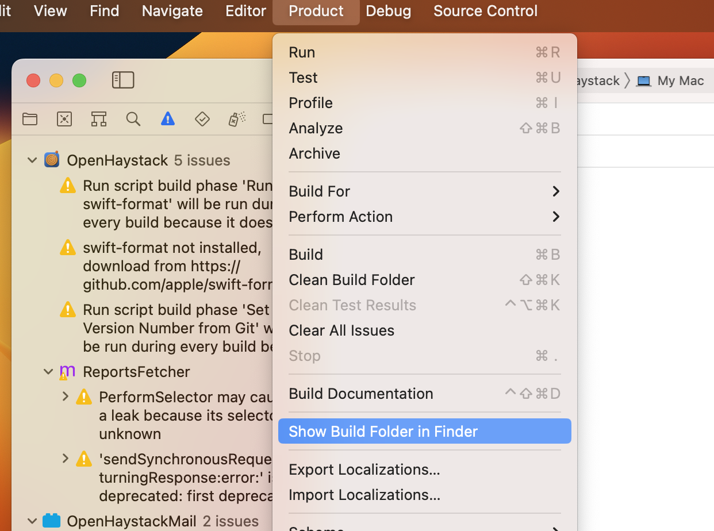

# How to build manually

Whenever there is a new MacOS update we need to update the proper Mail and MacOS version in this [plist](OpenHaystack/OpenHaystackMail/Info.plist)

## Prerequesites

1. You need to have Xcode installed. Latest build as of the time of writing is Xcode 14.2 on Ventura 13.2.
2. In Apple Mail you need to have you iCloud account to be enabled (without that it will not work ⚠️)
3. Apple Mail preferences dialog should show you the `Manage plug-ins` button. If not you will need to run `sudo defaults write "/Library/Preferences/com.apple.mail" EnableBundles 1` and restart Mail

## Steps

1. Locate `OpenHaystack/OpenHaystack.xcodeproj` in Finder and open it in Xcode
2. Xcode should load some dependencies, if this does not happen in Xcode go to `File / Packages / Reset Package Caches`

   
3. Now build the project (`Prodcut / Build`)

   
4. After building navigate to the output folder by clicking `Product / Show Build Folder in Finder`

   
5. In Finder navigate to the sub-folder `Build / Products / Debug` and start `OpenHayStack` from here
6. Acknowledge all upcoming popups but ignore the info, that there is a newer version available. When prompted install the Mail plugin with the default parameters
7. Apple Mail should now show you the new plug-in under `Manage plug-ins`
8. Now _close_ Mail, in the Terminal (or other shell) disable Gatekeeper `sudo spctl --master-disable`
9. Start Mail again and now enable the OpenHaystack plugin. You should be required to restart Mail. Afterwards the plugin is enabled. Close Mail again!
10. Re-enable Gatekeeper `sudo spctl --master-enable`
11. Verify in OpenHaystack that you have a proper connection (upper right corner should be a green light)